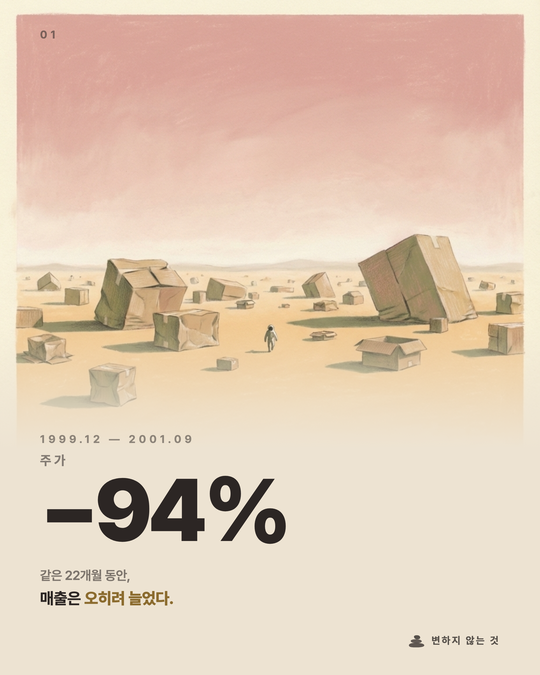
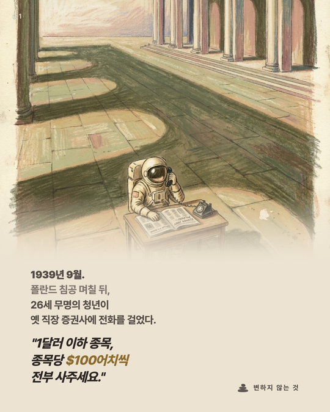
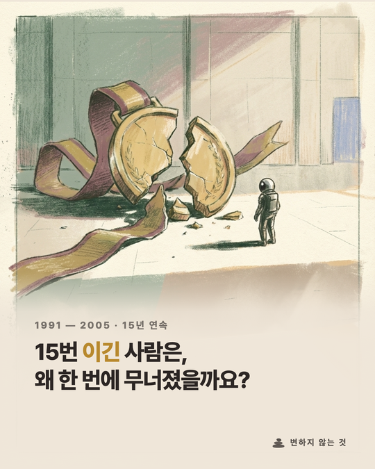

# cardnews-kit

> Build editorial carousels with AI — from benchmarking to publish.

A Claude Code skill pack that turns a proven editorial carousel workflow into
reusable slash commands. Extracted from a real Instagram account with 13 published posts.

**Finance, design, food, architecture, travel — change the topic, keep the pipeline.**

---

## Made with cardnews-kit

<p align="center">
  
  
  
</p>

<p align="center"><em>Investment philosophy editorial — 13-post carousel series</em></p>

---

## Quick Start

```bash
# 1. Clone the kit into your project
git clone https://github.com/allroundPark/cardnews-kit.git .cardnews-kit

# 2. Install Playwright (core dependency)
./.cardnews-kit/setup

# 3. Start onboarding in Claude Code
/ck-onboard

# 4. Create your first carousel
/ck-story
```

---

## Skills

### Phase 1 — Onboard (once)

Set up your creative identity. Run once when starting a new content project.

| Command | What it does |
|---|---|
| `/ck-onboard` | Full guided setup — philosophy, benchmark, design, voice |
| `/ck-benchmark` | Analyze reference accounts, extract story arc rhythms |
| `/ck-design-system` | Auto-generate design tokens from references (shotgun comparison) |
| `/ck-voice` | Define editorial voice, forbidden terms, story arc patterns |

**Onboarding produces:** `PHILOSOPHY.md` · `BENCHMARK.md` · `DESIGN.md` · `EDITORIAL.md` · `CLAUDE.md`

### Phase 2 — Produce (each post)

Repeatable cycle for every post. All skills support `--quick` mode.

| Command | What it does |
|---|---|
| `/ck-story` | Research angles, write content spec |
| `/ck-factcheck` | Verify data with source grading (✅ · ✅* · ⚠️ · ❌) |
| `/ck-illustrate` | AI image generation with style locking |
| `/ck-lint` | Quality gate — color, font, layout, editorial checks |
| `/ck-render` | Lint → HTML → PNG via Playwright, compare in browser |
| `/ck-publish` | Caption, README, final publish bundle |

### Infrastructure

| Module | What it does |
|---|---|
| `browse` | Shared Playwright browser for visual preview and comparison |

---

## How It Works

```
Phase 1: Onboard (once)
/ck-onboard → /ck-benchmark → /ck-design-system → /ck-voice
    │                │                 │                 │
    │           BENCHMARK.md       DESIGN.md      EDITORIAL.md
    │
    └── PHILOSOPHY.md + CLAUDE.md (auto-synthesized)


Phase 2: Produce (each post)
/ck-story → /ck-factcheck → /ck-illustrate → /ck-lint → /ck-render → /ck-publish
   │          │            │           │        │          │
  spec    verified     images      pass/fail   PNGs     bundle
```

---

## Philosophy

cardnews-kit is built on three beliefs:

1. **Your taste is the product.** Benchmarking is the start, but your judgment makes it yours.
2. **Content is the root.** Whatever you build next grows from content.
3. **Making closes the gap.** Each piece you ship narrows the distance between you and your audience.

Read the full philosophy in [ETHOS.md](ETHOS.md).

---

## Tool-Agnostic

Skills teach process, not tools. The core dependency is **Playwright** (for benchmarking
and rendering). Everything else is swappable:

| Capability | Reference adapter | Alternatives |
|---|---|---|
| Image generation | Gemini 3 Pro Image | DALL-E, Midjourney, Flux |
| Data verification | FMP API | Yahoo Finance, manual research |
| Publishing | Instagram carousel | Threads, LinkedIn, blog |

See [`adapters/reference/`](adapters/reference/) for working examples.

---

## Docs

- [ETHOS.md](ETHOS.md) — Kit philosophy
- [docs/skills.md](docs/skills.md) — Full skill descriptions and workflow details
- [CLAUDE.md](CLAUDE.md) — Claude Code integration guide

---

## License

[MIT](LICENSE)
